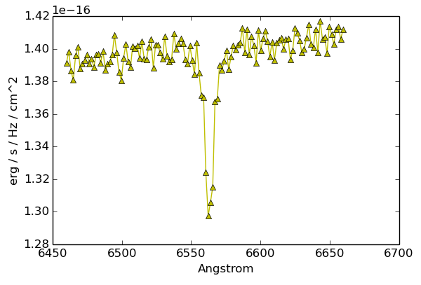

# Tarea nro. 10
## FI3104B - Métodos Numéricos para la Ciencia y la Ingeniería
#### Prof. Valentino González

## P1

La técnica de la espectroscopía consiste estudiar la radiación emitida por una
fuente como función de la longitud de onda. Las características de los
espectros observados tales como la intensidad y forma del contínuo y de las
líneas de emisión y absorción, nos permiten entender las propiedades físicas
del ente emisor de la radiación.

En la figura a continuación, se observa un segmento del espectro de una fuente
que muesta contínuo (con una leve pendiente) y una línea de absorción. Las
unidades son de flujo por unidad de frecuencia f&nu; [erg
s-1 Hz-1 cm-2] vs. longitud de onda en
[Angstrom]. Su trabajo consiste en modelar simultáneamente el contínuo y la
línea de absorción de la figura (los datos los encontrará en el archivo
`espectro.dat`).

Las líneas de absorción son en teoría casi infinitamente delgadas (hay un
ensanchamiento intrínseco dado por el principio de incertidumbre pero es muy
pequeño). Las observaciones, sin embargo, siempre muestran líneas mucho más
anchas. Dependiendo del mecanismo que produce el ensanchamiento, la forma de la
línea será distinta. Ud. deberá modelar la línea asumiendo los dos mechanismos
de ensanchamiento más típicos.

1. Primero modele la línea como si tuviese una forma Gaussiana. El modelo
   completo será el de una línea recta (2 parámetros: a y b; para el contínuo)
   menos una función gaussiana con 3 parámetros: amplitud, centro y varianza.
   Es decir, debe modelar 5 parámetros a la vez.
   > `scipy.stats.norm` implementa la función Gaussiana si no quiere escribirla
   > Ud. mismo. La forma de usarla es la siguiente: `g = A *
   > scipy.stats.norm(loc=mu, scale=sigma).pdf(x)`; donde x es la longitud de
   > onda donde evaluar la función.

1. El segundo modelo más típico de ensanchamiento corresponde al llamado perfil
   de Lorentz. De nuevo su modelo será el de una línea recta pero esta vez
   menos un perfil de Lorentz que tiene 3 parámetros: amplitud, centro y
   varianza. Nuevamente son 5 parámetros.
   > `scipy.stats.cauchy` implementa el perfil de Lorenz. Un ejemplo de su uso
   > sería: `l = A * scipy.stats.cauchy(loc=mu, scale=sigma).pdf(x)`

Produzca un gráfico que muestre el espectro observado y los dos mejores fits
obtenidos con cada uno de los modelos (gaussiano vs. lorentziano). Provea
también una tabla con los mejores parámetros de cada modelo (con sus unidades
correspondientes) y el valor de &chi;2.

> 1. En un análisis completo Ud. debería también calcular los intervalos de
>    confianza para cada parámetro pero esta vez no lo haremos por simplicidad.
> 1. Para buscar el mejor modelo puede usar alguno de los métodos vistos en
>    clase. Recuerde que es importante dar un punto de partida que sea cercano
>    para que los algoritmos converjan de manera efectiva. Ud. debe buscar
>    idear un método para buscar ese punto de partida.

## P2

En esta parte su trabajo es determinar cuál de los dos modelos anteriores
representa mejor a los datos.

> A su saber, ninguno de los dos es el modelo exacto a partir del cual se
> produjo el espectro. Determinar cuál modelo es el mejor, sin embargo, nos
> podría dar una idea de cuál es el mecanismo físico que produce el
> ensanchamiento en este caso.

Dada la naturaleza de los detectores que se usan para espectroscopía, los
errores asociados a la medición en cada pixel (correspondientes a la longitud
de onda) no son gaussianos sino poissonianos (ambas son similares para N
grande, pero no iguales). Como consecuencia, el valor de
&chi;2red y el test de &chi;2 asociado podrían
no ser significativos.

Por el motivo anterior, utilizaremos un test de Kolmogorov-Smirnov (que no
depende de los errores) para determinar la probabilidad asociada a la hipótesis
nula de cada modelo. Utilice el test para determinar: a) si los modelos son
aceptables, y b) cuál modelo es _mejor_ de acuerdo a este test.

__Otras Notas.__

- La tarea pide explícitamente un solo gráfico pero para hacer un informe
  completo Ud. debe decidir qué es interesante y crear las figuras
  correspondientes.

- Utilice `git` durante el desarrollo de la tarea para mantener un historial de
  los cambios realizados. La siguiente [*cheat
  sheet*](https://education.github.com/git-cheat-sheet-education.pdf) le puede
  ser útil. Evaluaremos el uso efectivo de `git`. Recuerde hacer cambios
  significativos pero relativamente pequeños y guardar seguido.  Evite hacer
  `commits` de código que no compila y deje mensajes que permitan entender los
  cambios realizados.

- Evaluaremos su uso correcto de python. Si define una función relativamente
  larga o con muchos parámetros, recuerde escribir el *doctsring* que describa
  los parámetros y que es lo que hace la función.  También recuerde usar nombres
  explicativos para las variables y las funciones.  El mejor nombre es aquel que
  permite entender que hace la función sin tener que leer su implementación.

- Los códigos entregados deben pasar las reglas de
  [PEP8](https://www.python.org/dev/peps/pep-0008/). En la línea de comando
  puede intentar `pep8 <script.py>` y asegurarse de que no hay errores ni
  advertencias. Los comandos `pep8 --show-source <script.py>` y `pep8
  --show-pep8 <script.py>` que vimos en clase le pueden ser útiles. Si es de
  aquellos que resuelven su tarea usando el `ipython notebook`, entonces exporte
  la tarea a un archivo normal de `python` y asegúrese de que pasa el test de
  PEP8.

- La tarea se entrega como un *pull request* en github. El *pull request* debe
  incluir todos los códigos usados además de su informe.

- El informe debe ser entregado en formato *pdf*, este debe ser claro sin
  información ni de más ni de menos.
